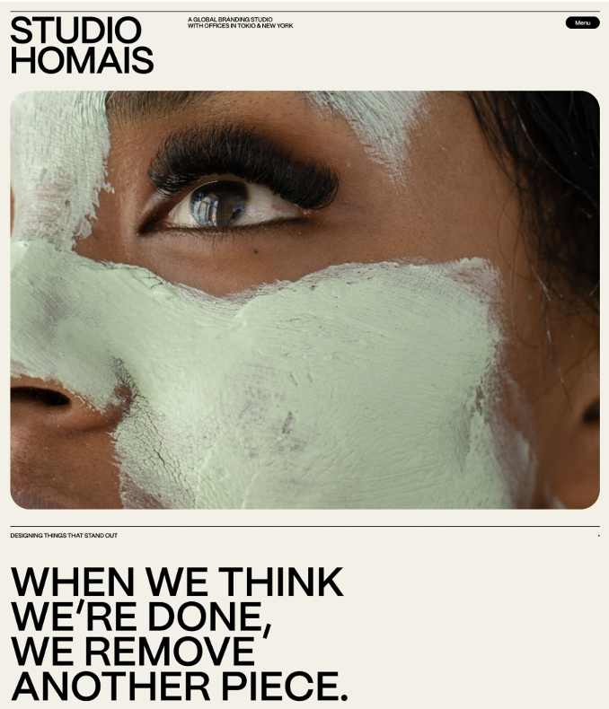

# Studio Homais – HTML-struktur

# Beskrivelse

Denne øvelse har fokus på **HTML-struktur, semantiske HTML-tags og den grundlæggende arbejdsgang med GitHub**.

Du tager udgangspunkt i et billede af det forventede resultat og et udleveret projekt på GitHub.com.

I projektet får du blandt andet:

- en eksisterende `index.html`, som du skal arbejde videre i
- `studio_homais.txt`, som indeholder al den tekst, du skal bruge
- et billede i `/img`-mappen, som skal indsættes på hjemmesiden
- `studio-homais-finished.png`, som viser, hvordan den færdige hjemmeside tilnærmelsesvis skal se ud

Du skal **ikke oprette en ny `index.html`**. Du skal arbejde videre i den udleverede fil.

Din opgave er at analysere mockuppen og opbygge hjemmesiden ved hjælp af **HTML alene**.

Du skal forsøge at komme **så tæt på det viste resultat som muligt med de muligheder, HTML giver dig**, men du må ikke bruge CSS til at styre hjemmesidens layout, farver, skrifttyper, størrelser eller placering af elementer.

Det betyder, at din hjemmeside ikke kommer til at ligne mockuppen fuldstændigt. Det er helt forventeligt.

Gennem øvelsen skal du:

- undersøge, hvordan indholdet i en mockup kan omsættes til HTML
- arbejde med grundlæggende og semantiske HTML5-tags
- opbygge en korrekt HTML5-struktur
- arbejde med overskrifter, tekst, navigation og billeder
- overveje, hvilke dele af siden der naturligt hører sammen
- forsøge at tilnærme dig mockuppen ved hjælp af HTML alene
- bruge **GitHub.com** til at oprette dit eget repository
- bruge **GitHub Desktop** til at hente projektet ned på din computer og gemme dine ændringer på GitHub
- arbejde med projektet i **Visual Studio Code**

Formålet er at styrke din forståelse af **HTML som struktur og indhold** og samtidig opleve, hvad HTML kan – og ikke kan – uden CSS.

> **Vigtigt:** I denne opgave må du kun bruge **HTML**. Du må **ikke bruge CSS**, hverken som ekstern CSS, intern CSS med `<style>` eller inline CSS med `style=""`.

---

## Forventet resultat

Nedenfor kan du se `studio-homais-finished.png`, som viser det resultat, du skal forsøge at tilnærme dig.

Du skal komme **så tæt på det viste resultat som muligt ved hjælp af HTML alene**. Det forventes derfor ikke, at din hjemmeside bliver visuelt identisk med billedet.

<!-- Billedet studio-homais-finished.png skal ligge i projektets rodmappe -->



> **Husk:** Billedet viser dit visuelle mål – ikke et facit på HTML-koden. Du skal selv vurdere, hvordan indholdet bedst struktureres med HTML.

---

## Fremgangsmåde

### 1. Opret dit eget repository fra projektet

Gå til det udleverede **Studio Homais-repository `studio-homais-html` på GitHub.com**.

Vælg:

**Use this template → Create a new repository**

Opret herefter projektet som et nyt repository på **din egen GitHub-konto**.

Navngiv dit repository:

`studio-homais-html-exercise`

Du skal ikke arbejde direkte i underviserens repository.

### 2. Clone dit repository med GitHub Desktop

Når dit repository er oprettet:

1. Åbn **GitHub Desktop**.
2. Vælg **File → Clone repository**.
3. Find dit nye Studio Homais-repository under dine GitHub-repositories.
4. Vælg, hvor projektet skal gemmes på din computer.
5. Klik på **Clone**.

Du har nu en lokal kopi af dit GitHub-repository på din computer.

### 3. Åbn projektet i Visual Studio Code

Åbn projektmappen i **Visual Studio Code**.

Undersøg først de filer og mapper, der allerede ligger i projektet.

Du finder blandt andet:

- filen `index.html`, som allerede indeholder den grundlæggende HTML5-struktur
- filen `studio_homais.txt`, som indeholder **al den tekst**, du skal bruge på hjemmesiden
- mappen `/img` med det billede, du skal bruge på hjemmesiden
- filen `studio-homais-finished.png`, som viser det forventede resultat
- README-filen
- eventuelle øvrige projektfiler

Filen `index.html` ser fra starten sådan ud:

```html
<!DOCTYPE html>
<html lang="en">
<head>
    <meta charset="UTF-8">
    <meta name="viewport" content="width=device-width, initial-scale=1.0">
    <title>Document</title>
</head>
<body>

</body>
</html>
```

Du skal **ikke oprette en ny `index.html`-fil**. Du skal arbejde videre i den eksisterende fil og opbygge resten af hjemmesidens HTML-struktur.

### 4. Gennemgå `<head>` og opdatér sidens titel

Inden du begynder at arbejde med indholdet i `<body>`, skal du undersøge den HTML5-struktur, der allerede findes i `index.html`.

I `<head>` finder du blandt andet:

- `<meta charset="UTF-8">`
- `<meta name="viewport" content="width=device-width, initial-scale=1.0">`
- `<title>Document</title>`

Opdatér sidens `<title>`, så den passer til hjemmesiden:

```html
<title>Studio Homais</title>
```

Undersøg også kort:

- hvad `lang="en"` fortæller om dokumentets sprog
- hvad `charset="UTF-8"` bruges til
- hvorfor `viewport`-meta-tagget er vigtigt

Du skal ikke ændre `charset` eller `viewport` i denne opgave. Formålet er, at du begynder at forstå, hvad de forskellige dele af den grundlæggende HTML5-struktur bruges til.

### 5. Undersøg det forventede resultat

Inden du begynder at skrive HTML, skal du undersøge billedet under **Forventet resultat**.

Overvej blandt andet:

- Hvilke forskellige områder består siden af?
- Hvad er sidens vigtigste overskrift?
- Hvad fungerer som navigation?
- Hvilket indhold hører naturligt sammen?
- Hvilken tekst er overskrift, og hvilken tekst er almindeligt indhold?
- Hvor vil det være relevant at bruge semantiske HTML-tags?
- Hvilke dele af det viste design kan du tilnærme dig med HTML alene?
- Hvilke dele vil normalt kræve CSS?

Din opgave er at komme **så tæt på det viste resultat som muligt med HTML alene**.

Du må ikke bruge CSS for at få resultatet til at ligne mockuppen bedre.

### 6. Arbejd videre med HTML-strukturen

Åbn den eksisterende `index.html`-fil og arbejd videre med den HTML5-struktur, der allerede er oprettet.

Du skal selv tilføje og strukturere indholdet i `<body>`.

Du kan blandt andet undersøge, om følgende tags er relevante:

- `<header>`
- `<nav>`
- `<main>`
- `<section>`
- `<h1>`
- `<h2>`
- `<p>`
- ``
- `<hr>`
- `<strong>`
- `<em>`
- `<br>`

Du skal selv vurdere, hvilke tags der passer til de forskellige dele af hjemmesiden.

**I denne opgave må du kun bruge HTML. Du må ikke bruge CSS.**

Forsøg at komme **så tæt på det forventede resultat som muligt ved hjælp af HTML alene**. Nogle visuelle egenskaber i mockuppen kræver CSS og kan derfor ikke genskabes præcist i denne opgave.

### 6. Tilføj tekst og billede

Åbn filen `studio_homais.txt`.

Filen indeholder **al den tekst, du skal bruge på hjemmesiden**. Du skal derfor ikke selv skrive ny tekst til siden.

Din opgave er at flytte teksten fra `studio_homais.txt` ind i `index.html` og vurdere, hvilke HTML-tags der bedst beskriver og strukturerer indholdet.

Brug derefter det billede, der allerede ligger i projektets `/img`-mappe.

Husk at give billedet en relevant `alt`-tekst.

Når du arbejder med det visuelle udtryk, må du gerne undersøge, om HTML-elementer som `<hr>`, `<strong>`, `<em>` og `<br>` giver mening i forhold til indholdet og det forventede resultat. Brug dem kun, når de også er fagligt meningsfulde – ikke som erstatning for CSS.

### 8. Gem dine ændringer med commits

Når du har lavet en meningsfuld ændring i projektet:

1. Gem dine filer i Visual Studio Code.
2. Gå tilbage til **GitHub Desktop**.
3. Se de ændringer, du har foretaget.
4. Skriv en kort og meningsfuld **commit message**.
5. Vælg **Commit to main**.

En commit gemmer et punkt i projektets historik.

Eksempler på commit messages:

- `Oprettet grundlæggende HTML-struktur`
- `Tilføjet header og navigation`
- `Tilføjet Studio Homais indhold`
- `Tilføjet billede og alt-tekst`
- `Opdateret semantisk struktur`

Undgå upræcise beskeder som:

- `ændringer`
- `test`
- `færdig`

### 9. Push dine ændringer til GitHub.com

Efter dine commits skal du vælge:

**Push origin**

i GitHub Desktop.

Dine seneste commits bliver herefter sendt fra din computer til dit repository på **GitHub.com**.

Kontrollér til sidst på GitHub.com, at dine ændringer kan ses i repository'et.

---

## Krav til opgaven

Din løsning skal:

- indeholde en korrekt HTML5-struktur
- indeholde både `<head>` og `<body>`
- have `<title>Studio Homais</title>` i `<head>`
- beholde `lang="en"`, `charset="UTF-8"` og det eksisterende `viewport`-meta-tag
- anvende relevante semantiske HTML5-tags
- have en logisk overskriftsstruktur
- indeholde al teksten fra `studio_homais.txt`
- bruge det udleverede billede fra `/img`-mappen
- tage udgangspunkt i `studio-homais-finished.png` som visuelt mål
- have en relevant `alt`-tekst til billedet
- have korrekt indentation og formatering
- have `index.html` placeret i projektets rodmappe

**Fokus i denne opgave er HTML-struktur og indhold. Du må kun bruge HTML og må ikke anvende CSS. Forsøg samtidig at komme så tæt på det forventede resultat som muligt med HTML alene.**

---

## Validér din HTML

Når du mener, at din HTML er færdig, skal du validere den på:

**validator.w3.org**

Ret eventuelle fejl i HTML-koden, inden du afleverer.

Du kan også bruge:

- **W3Schools** til at undersøge HTML-tags
- **MDN Web Docs** til at læse om semantiske HTML-elementer

---

## Din grundlæggende arbejdsgang

I denne og kommende opgaver skal du begynde at vænne dig til følgende arbejdsgang:

**GitHub.com → Clone → Visual Studio Code → Ændring → Commit → Push → GitHub.com**

Du behøver ikke kunne huske alle begreberne fra starten. Formålet med de første opgaver er, at arbejdsgangen gradvist bliver en naturlig del af dit arbejde med frontend-programmering.

---

## Aflevering

Inden du afleverer, skal du kontrollere:

- at `index.html` ligger i projektets rodmappe
- at sidens `<title>` er ændret til `Studio Homais`
- at din HTML er valideret
- at dine seneste ændringer er pushet til GitHub.com
- at dit repository er offentligt

Aflever derefter **linket til dit GitHub-repository på Canvas**.
